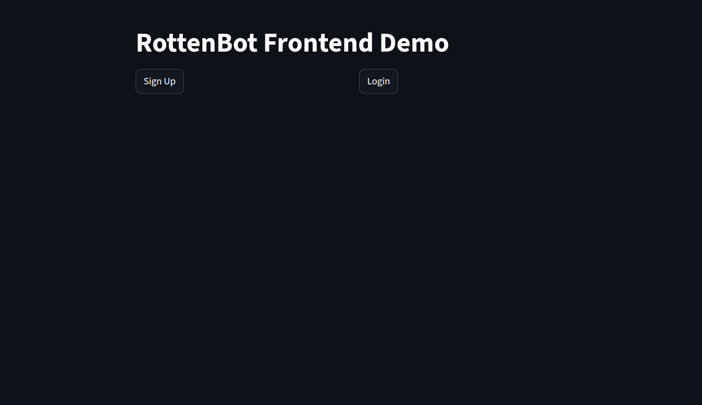
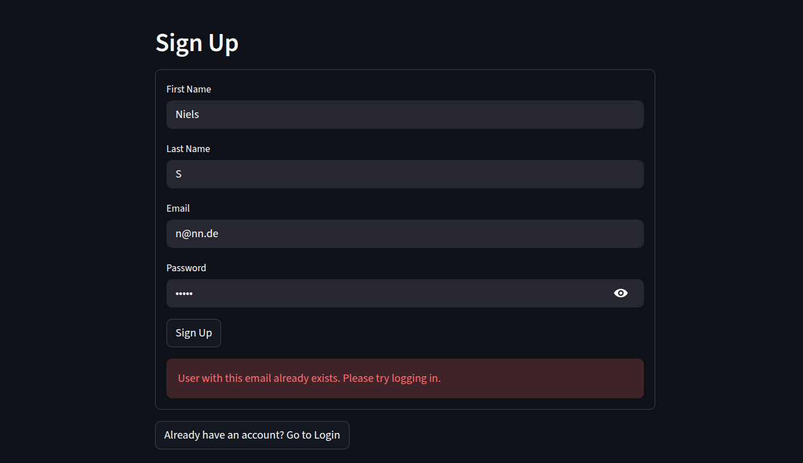
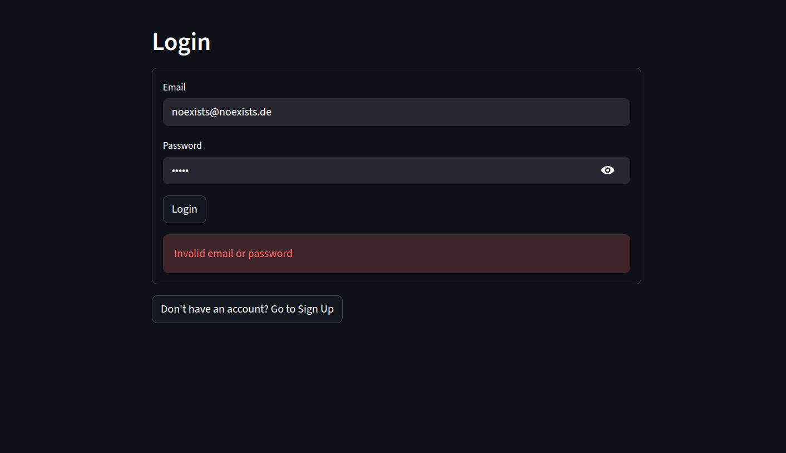
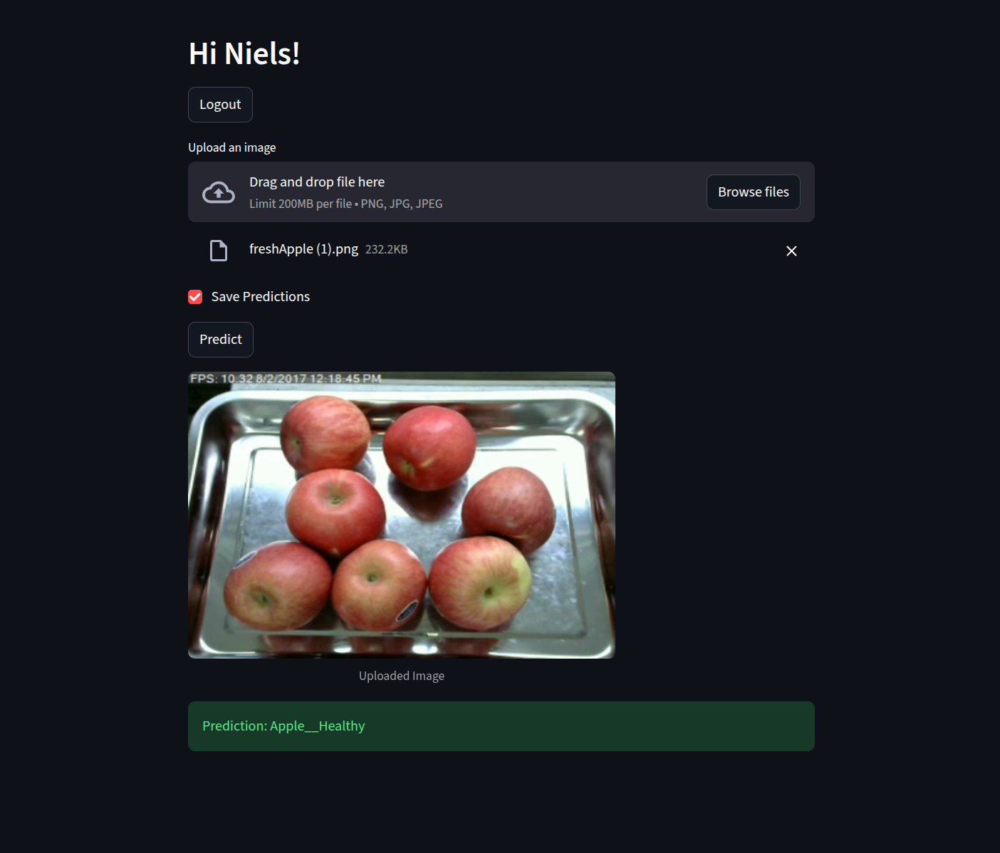

# RottenBot - Frontend Service

## 🎯 Overview

This repository provides the **web frontend microservice** for the RottenBot project. Built with **Streamlit**, this service offers a simple and intuitive demo interface for user authentication and image classification. The Frontend Service emphasizes **ease of use**, **quick prototyping**, and **seamless integration** with the RottenBot ecosystem.

The Frontend was developed as a demonstration interface to showcase the RottenBot system's capabilities. Streamlit was chosen because it enables rapid development of data-driven web applications without requiring extensive frontend development experience (HTML, CSS, React, Tailwind, Next.js, etc.). This makes the project accessible for testing and demonstration purposes while maintaining clean integration with backend microservices.

## ✨ Key Features

### User Interface
- 🎨 **Clean Streamlit Interface** for intuitive user experience
- 📱 **Responsive Design** adapting to different screen sizes
- 🔄 **Session State Management** for authentication persistence
- 🖼️ **Image Upload & Preview** with real-time feedback

### Authentication Flow
- 📝 **User Registration** with form validation
- 🔐 **Secure Login** with JWT token management
- 👤 **User Session Handling** with access and refresh tokens
- 🔄 **Seamless Page Navigation** between signup, login, and prediction views

### Image Classification
- 🤖 **Real-Time Predictions** via InferenceService integration
- 📊 **Confidence Score Display** for prediction reliability
- 💾 **Optional Prediction Saving** giving users control over data persistence
- ⚠️ **Confidence Threshold** with user-friendly error messages

### Integration & Architecture
- 🔗 **RESTful API Integration** with AuthService and InferenceService
- 🚀 **Microservice Architecture** enabling independent scaling

## 🎨 User Interface Flow

### 1. Main Page
Landing page offering two options:
- **Sign Up** - Create a new account
- **Login** - Access existing account

Example of Main Page: 



### 2. Sign Up Page
Registration form with fields:
- First Name
- Last Name
- Email
- Password

Automatically redirects to login after successful registration.

Example of Sign Up Page: 



### 3. Login Page
Authentication form with:
- Email
- Password

Stores JWT tokens in session state upon successful login and redirects to the Prediction Page after successful login.

Example of Login Page: 



### 4. Prediction Page
Main application interface featuring:
- Image upload (PNG, JPG, JPEG)
- Image preview
- "Save Predictions" checkbox
- Prediction button
- Results display with confidence score

Example of Prediction Page: 



## 🚀 Quick Start

### Prerequisites
- **Docker & Docker Compose** for service orchestration
- **RottenBot_AuthService** running for user authentication
- **RottenBot_InferenceService** running for image classification

### Running with Docker Compose

```yaml
frontend_service:
  container_name: frontend_service
  image: nielsscholz/rotten_bot_frontend:latest
  ports:
    - "8501:8501"
  environment:
    # look in the .env.example file for all required environment variables and explanations.
    LOGIN_ENDPOINT: ${LOGIN_ENDPOINT}           
    SIGNUP_ENDPOINT: ${SIGNUP_ENDPOINT}         
    PREDICT_ENDPOINT: ${PREDICT_ENDPOINT}       
```

## 🤖 CI/CD Pipeline

### Current Implementation

This project includes a **simple CI pipeline** that automatically builds and deploys the Docker image to Docker Hub.

**Pipeline Trigger:**
- Runs on every commit to the `main` branch
- Automatically builds the Docker image using the Dockerfile
- Pushes the image to Docker Hub as `nielsscholz/rotten_bot_frontend:latest`

### ⚠️ Important Notes

**This is NOT a production-ready pipeline!** The current setup was implemented for simplicity and demonstration purposes.

**Current Limitations:**
- No branch strategy (dev, staging, prod)
- Commits directly to `main` trigger deployment
- No automated testing before deployment
- No security scanning

## 📝 License

This project is part of the RottenBot ecosystem. See the main RottenBot repository for licensing information.
